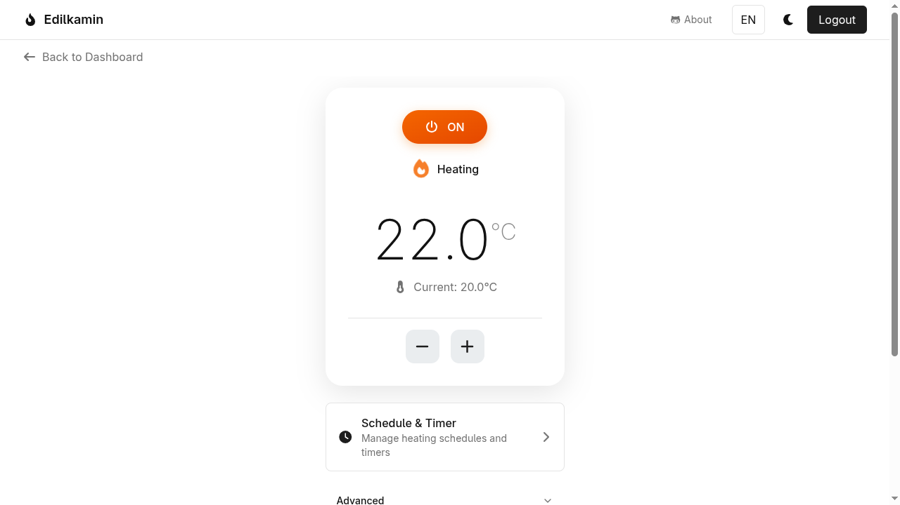
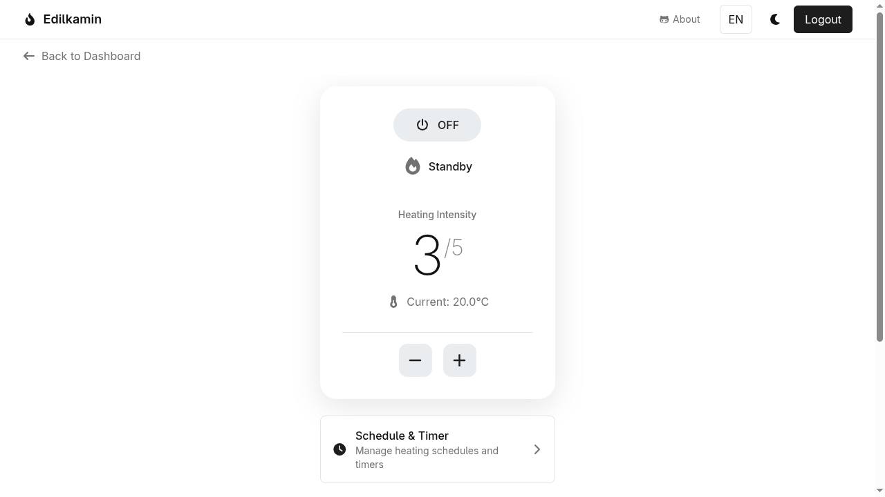

# Open Edilkamin

[](https://github.com/AndreMiras/edilkamin/actions/workflows/tests.yml)
[](https://codecov.io/gh/AndreMiras/edilkamin)
[](https://opensource.org/licenses/MIT)
[](https://play.google.com/store/apps/details?id=com.github.andremiras.edilkamin)

<https://edilkamin.vercel.app/> | [Android App](https://play.google.com/store/apps/details?id=com.github.andremiras.edilkamin)

This is an open alternative to the
[Edilkamin The Mind](https://play.google.com/store/apps/details?id=com.edilkamin.stufe) application
used for controlling pellet heating systems wirelessly.

This is built on top of the [edilkamin.js](https://github.com/AndreMiras/edilkamin.js) library.

## Run

```sh
yarn dev
```

## Test

```sh
yarn lint
yarn test
```

## E2E Testing

The project uses [Playwright](https://playwright.dev/) for end-to-end testing with real browser automation.

### Screenshots

| Stove Control                                       | Powered Off                                 |
| --------------------------------------------------- | ------------------------------------------- |
|  |  |

### Running E2E Tests

```sh
# Run all E2E tests (headless)
yarn e2e

# Run with visible browser (debugging)
yarn e2e:headed

# Run with interactive UI mode (best for development)
yarn e2e:ui

# Run visual regression tests only
yarn e2e:visual

# Update visual regression baselines (after UI changes)
yarn e2e:visual:update

# Generate documentation screenshots
yarn e2e:screenshots
```

### Visual Regression Testing

Visual regression tests capture screenshots and compare them against baselines stored in `e2e/visual-baselines/`. If you intentionally change the UI:

1. Review the changes locally with `yarn e2e:ui`
2. Update baselines with `yarn e2e:visual:update`
3. Commit the new baseline screenshots

### CI/CD

E2E tests run automatically on every push and pull request via GitHub Actions. Test reports are uploaded as artifacts.

## Mobile Development (Android)

The app can be built as a native Android app using [Capacitor](https://capacitorjs.com/).

### Requirements

- **Node.js** 24.x
- **Java** 21+ (OpenJDK recommended)
- **Android Studio** Meerkat (2024.3.1) or newer
- **Android SDK** 36

On Arch Linux:

```sh
sudo pacman -S jdk21-openjdk
sudo archlinux-java set java-21-openjdk
yay -S android-studio
```

### Build & Run

1. Build the web app for static export:

   ```sh
   yarn build:mobile
   ```

2. Sync web assets to the Android project:

   ```sh
   yarn cap:sync
   ```

3. Open in Android Studio:

   ```sh
   npx cap open android
   ```

4. Run on device/emulator from Android Studio (Shift+F10)

### Development Workflow

After making changes to the web app:

```sh
yarn build:mobile && yarn cap:sync
```

Then rebuild from Android Studio.

## License

This project is licensed under the MIT License - see the [LICENSE](LICENSE) file for details.
